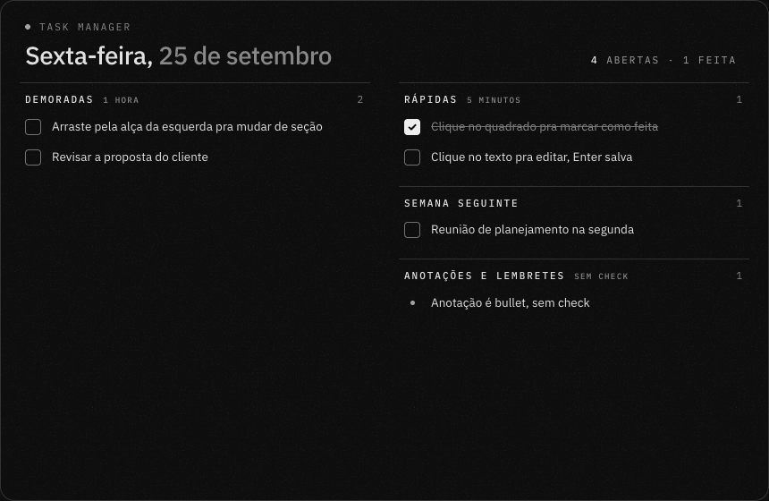
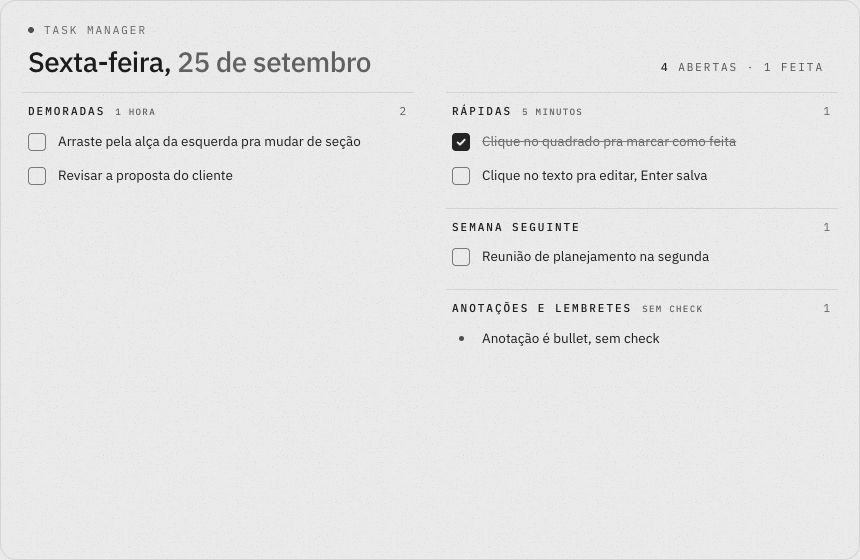
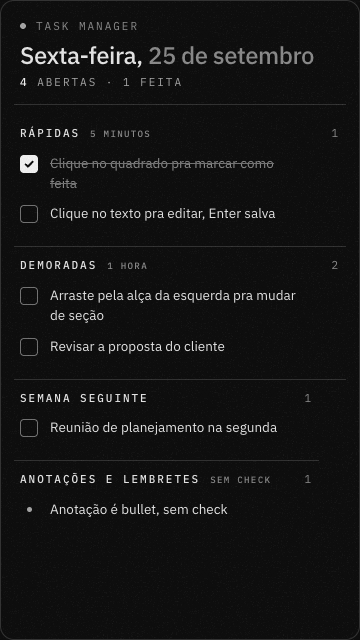

# Task Manager

Lista de tarefas pessoal pro macOS, que roda 100% local e aparece em três lugares ao mesmo tempo:

- **No navegador**, em `http://localhost:8790`
- **Na barra de menu**, com o número de tarefas abertas; clicou, abre a lista num painel
- **No canto da tela**: encostou o mouse no canto superior direito, a lista abre no centro, larga e em duas colunas
- **Na mesa** (opcional), como widget fixo na área de trabalho

Tudo lê o mesmo arquivo, então marcar num lugar atualiza os outros em segundos. Segue o tema do sistema (claro ou escuro) sozinho.



| Claro | Widget da mesa |
|---|---|
|  |  |

## O que precisa

- macOS 13 ou mais novo
- Ferramentas de linha de comando da Apple (trazem `python3` e `swiftc`). Se não tiver:

```bash
xcode-select --install
```

- Opcional, só pro widget da mesa: [Übersicht](https://tracesof.net/uebersicht/)

```bash
brew install --cask ubersicht
```

Não tem dependência de Python nem de Node. O servidor usa só a biblioteca padrão.

## Instalar

```bash
git clone https://github.com/luansinezio/task-manager-mac.git
cd task-manager-mac
./instalar.sh
```

O instalador:

1. Registra o servidor como serviço do macOS: sobe no login e reinicia se cair.
2. Compila o app **Tarefas** (barra de menu, canto da tela e, se quiser, Dock) em `~/Applications/Tarefas.app`. Na primeira vez ele se registra pra abrir no login.
3. Desliga o Canto Ativo do macOS no canto superior direito, pra não abrir duas coisas ao mesmo tempo.
4. Se o Übersicht estiver instalado, liga o widget da mesa.

Na primeira vez que você ligar ou desligar o widget pelos ajustes, o macOS pergunta se o Tarefas pode controlar o Übersicht. É só permitir.

Na primeira vez a lista começa com tarefas de exemplo. Suas tarefas ficam em `dados/tarefas.json`, que não vai pro git.

## Usar

| Onde | Como |
|---|---|
| Marcar como feita | Clique no quadrado |
| Editar | Clique no texto; Enter salva, Esc cancela; apagar o texto apaga a tarefa |
| Adicionar | "+ Adicionar" no fim de cada seção |
| Mudar de seção | Arraste pela alça à esquerda da tarefa (na página) |
| Limpar o dia | Botão "Limpar feitas" tira tudo o que já foi marcado |
| Canto da tela | Mouse no canto superior direito abre; Esc, clique fora ou o canto de novo fecha |
| Barra de menu | Clique abre o painel; botão direito tem Ajustes, Abrir no navegador, Recarregar e Sair |
| Ajustes | Engrenagem no topo do painel: onde o app aparece (barra de menu, Dock ou os dois), widget da mesa ligado ou não, atalho do canto, abrir ao ligar o Mac |
| Tema | Segue o sistema. Na página dá pra forçar claro ou escuro no botão de tema |

### Pelo terminal

Útil pra scripts e pra agentes de IA (Claude Code, Codex) mexerem na lista:

```bash
python3 tm.py lista
python3 tm.py add rapidas "Responder o fulano"
python3 tm.py check t04            # alterna feito/aberto
python3 tm.py edit t04 "Texto novo"
python3 tm.py move t04 amanha
python3 tm.py rm t04
python3 tm.py limpar               # tira as feitas
```

Seções: `rapidas`, `demoradas`, `particular`, `semana`, `amanha`, `anotacoes`. A tela pega a mudança em até 2 segundos.

## Personalizar

- **Seções e títulos:** edite `dados/tarefas.json` (chave `secoes` e a ordem em `colunas`).
- **Visual:** tudo em `public/index.html`, com as cores em variáveis CSS no topo.
- **Posição e tamanho do widget da mesa:** `className` em `widget/task-manager.jsx`.
- **Porta:** variável `TM_PORTA` (padrão 8790). Se mudar, ajuste `BASE` em `barra-app/main.swift` e a URL do widget.
- Depois de mexer no app da barra: `./barra-app/instalar.sh` recompila.

## Desinstalar

```bash
./desinstalar.sh
```

Remove o serviço, o app e o widget. As tarefas em `dados/tarefas.json` ficam.

## Como é feito

```
servidor.py        API local (GET /api/tarefas, POST /api/op) e arquivos da página
tm.py              núcleo: lê, altera e grava o JSON com trava e gravação atômica; também é a CLI
public/index.html  a página (modos: normal, ?widget, ?widget&largo, &moldura, &tema=claro|escuro)
barra-app/         app nativo em Swift (NSStatusItem + WKWebView), sem Xcode, compilado com swiftc; icone.swift gera o AppIcon.icns
widget/            widget do Übersicht
```

Visual baseado no guia de marca pessoal de Luan Sinézio: cinza neutro, IBM Plex Sans e Mono, grão leve.

## Licença

MIT
